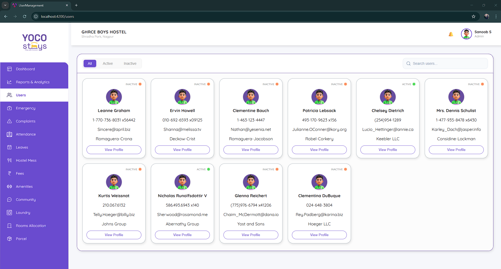

# User Management Dashboard (Angular)

This is a simple Angular application built as part of an assessment.  
The app fetches users from an external API and displays them in a responsive card/grid layout with search, filter, and detail view functionality.

---



## Features

- Fetch users from API on page load
- Display users in a responsive card/grid layout
- Show user details:
  - Name
  - Phone
  - Email / Username
  - Company name
- Search users by name or username
- Status filter tabs (All / Active / In-Active)
  - Status is mocked locally
- View detailed user profile via modal
- Fully responsive (Desktop & Mobile)

---

## Tech Stack

- Angular
- TypeScript
- HTML5 / CSS3
- RxJS

---

## Setup & Run Locally

### Prerequisites
- Node.js (v16+ recommended)
- Angular CLI

### Steps

```bash
git clone <your-github-repo-link>
cd <project-folder>
npm install
ng serve


